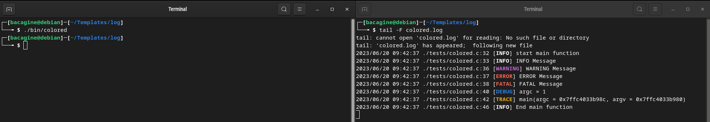

# libtrace



My personal debug library for my C/C++ programs

To better understand my codes, read the README.md at [this link](https://github.com/Bacagine/Bacagine)


# How to use?

## Log Levels

- INFO_LEVEL    (0): Normal messages
- WARNING_LEVEL (1): Alert messages
- ERROR_LEVEL   (2): Errors that not cause the interruption of program
- FATAL_LEVEL   (3): Erros that cause the interruption of program
- DEBUG_LEVEL   (4): Detailed messages intended for the programmer
- TRACE_LEVEL   (5): Messages more detailed than DEBUG_LEVEL level. Show all trace level messages

## Configuration file

Your application needs a .conf file, in this file you add the follow contents:

```shell
# 0 to 5
LOG_LEVEL = 5

# true or false
COLORED_LOG_LEVEL = false
```

## Build and Install
```
# ./mkinstall
```

## Examples of usage

### Example 1 - colored.c
```c
/**
 * colored.c: Test to trace library, using colored trace level
 *
 * Written by Gustavo Bacagine <gustavo.bacagine@protonmail.com>
 * 
 * Date: 2023-06-16
 */

#include <stdio.h>
#include "trace.h"

#define UNUSED(X) (void) X

int main(int argc, char **argv)
{
  int iColoredLogLevel;
  
  UNUSED(argc);
  UNUSED(argv);
  UNUSED(gbColoredLogLevel);
  UNUSED(gszLogFileName);
  UNUSED(gszConfFileName);
  UNUSED(kszLogLevelColorEnd);
  UNUSED(kszLogLevelColorInit);
  UNUSED(kszLogLevel);

  vSetConfFileName("trace.conf");

  vSetLogLevel(iGetLogLevel());

  if(giDebugLevel < 0)
  {
    fprintf(stderr, "Error, giDebugLevel return value: %d!\n", giDebugLevel);

    exit(EXIT_FAILURE);
  }
  
  iColoredLogLevel = iGetColoredLogLevel();
  
  if(iColoredLogLevel == 0 || iColoredLogLevel == 1)
  {
    vSetColoredLogLevel(iColoredLogLevel);
  }
  
  vSetLogFileName("colored.log");
  
  if(INFO_DETAILS)
  {
    vTraceInfo("start %s function", __func__);
    vTraceInfo("INFO Message"      );
  }

  if(WARNING_DETAILS) vTraceWarning("WARNING Message");
  if(ERROR_DETAILS  ) vTraceError("ERROR Message"    );
  if(FATAL_DETAILS  ) vTraceFatal("FATAL Message"    );
  
  if(DEBUG_DETAILS  ) vTraceDebug("argc = %d", argc);

  if(TRACE_DETAILS  ) vTraceAll("%s(argc = %p, argv = %p)", __func__, &argc, &argv);
  
  if(INFO_DETAILS)
  {
    vTraceInfo("End %s function", __func__);
  }

  return 0;
}

```

### Example 2 debug.c

```c
/**
 * debug.c: Exemple of the DEBUG_DETAILS
 * 
 * Written by Gustavo Bacagine <gustavo.bacagine@protonmail.com>
 * 
 * Date: 2023-06-17
 */

#include <stdio.h>
#include <stdlib.h>
#include <string.h>
#include <stdint.h>
#include "trace.h"

#define UNUSED(X) (void) X

/**
 * Structure that 
 * represents a person
 */
typedef struct Person
{
  char szName[64];
  uint8_t uAge;
} Person, *PPerson;

static void vInitPerson(PPerson *ppstPerson)
{
  if(INFO_DETAILS)
  {
    vTraceInfo("start %s function", __func__);
    vTraceInfo("Setting the default values in members of struct Person");
  }
  
  memset((*ppstPerson)->szName, 0, sizeof((*ppstPerson)->uAge));
  (*ppstPerson)->uAge = 0;
  
  if(DEBUG_DETAILS)
  {
    vTraceDebug("memset((*ppstPerson)->szName, 0, sizeof((*ppstPerson)->uAge))");
    vTraceDebug("(*ppstPerson)->uAge = 0");
  }

  if(INFO_DETAILS)
  {
    vTraceInfo("end %s function", __func__);
  }
}
  
static void vCreatePerson(PPerson *ppstPerson, const char *szName, const uint8_t uAge)
{
  if(INFO_DETAILS)
  {
    vTraceInfo("start %s function", __func__);
    vTraceInfo("create a new person");
  }

  strcpy((*ppstPerson)->szName, szName);
  (*ppstPerson)->uAge = uAge;

  if(DEBUG_DETAILS)
  {
    vTraceDebug("Values of the member Person");
    vTraceDebug("(*ppstPerson)->szName = %s", (*ppstPerson)->szName);
    vTraceDebug("(*ppstPerson)->uAge = %d", (*ppstPerson)->uAge);
  }

  if(INFO_DETAILS)
  {
    vTraceInfo("Person created with succes");
    vTraceInfo("end %s function", __func__);
  }
}

static void vShowPerson(PPerson pstPerson)
{
  if(INFO_DETAILS)
  {
    vTraceInfo("start %s function", __func__);
    vTraceInfo("Show Person");
    vTraceInfo("Name: %s\n"
             "Age.: %d\n", pstPerson->szName,
                           pstPerson->uAge);
  }

  printf("Name: %s\n"
         "Age.: %d\n", pstPerson->szName,
                       pstPerson->uAge);

  if(INFO_DETAILS)
  {
    vTraceInfo("end %s function", __func__);
  }
}

static void vDestroyPerson(PPerson *ppstPerson)
{
  if(INFO_DETAILS)
  {
    vTraceInfo("start %s function", __func__);
  }
  
  memset((*ppstPerson)->szName, 0, sizeof((*ppstPerson)->uAge));
  (*ppstPerson)->uAge = 0;
  
  if(DEBUG_DETAILS)
  {
    vTraceDebug("memset((*ppstPerson)->szName, 0, sizeof((*ppstPerson)->uAge))");
    vTraceDebug("(*ppstPerson)->uAge = 0");
    vTraceDebug("Freeing Person structure pointer");
  }

  free((*ppstPerson));
  (*ppstPerson) = NULL;

  if(DEBUG_DETAILS)
  {
    vTraceDebug("free((*ppstPerson))");
    vTraceDebug("(*ppstPerson) = NULL");
    vTraceDebug("Person structure pointer free");
  }

  if(INFO_DETAILS)
  {
    vTraceInfo("end %s function", __func__);
  }
}

int main(int argc, char **argv)
{
  PPerson pstPerson = (PPerson) malloc(sizeof(Person));
  
  UNUSED(argc);
  UNUSED(argv);
  UNUSED(gbColoredLogLevel);
  UNUSED(gszLogFileName);
  UNUSED(gszConfFileName);
  UNUSED(kszLogLevelColorEnd);
  UNUSED(kszLogLevelColorInit);
  UNUSED(kszLogLevel);
  
  vSetConfFileName("trace.conf");
  
  vSetLogLevel(iGetLogLevel());

  if(giDebugLevel < 0)
  {
    fprintf(stderr, "Error, giDebugLevel return value: %d!\n", giDebugLevel);

    exit(EXIT_FAILURE);
  }
  
  vSetLogFileName("debug.log");
  
  /* Initial trace messages */
  if(INFO_DETAILS)
  {
    vTraceInfo("Start of function %s", __func__);
  }
  
  if(pstPerson == NULL)
  {
    if(DEBUG_DETAILS)
    {
      vTraceDebug("E: out memory in allocation of pstPerson!");
    }
  }

  vInitPerson(&pstPerson);
  
  vCreatePerson(&pstPerson, "Gustavo Bacagine", 23);
  
  vShowPerson(pstPerson);

  vDestroyPerson(&pstPerson);
  
  /* End trace messages */
  if(INFO_DETAILS)
  {
    vTraceInfo("End of function %s", __func__);
  }

  return 0;
}

```

### Example 3 - hello_trace.c
```c
/**
 * hello_trace.c
 *
 * Writeen by Gustavo Bacagine <gustavo.bacaigne@protonmail.com>
 *
 * Descritpion: Print a hello world in a trace file.
 * 
 * Date: 23/09/2023
 */

#include <stdio.h>
#include "trace.h"

#define UNUSED(X) (void) X

int main(int argc, char **argv)
{
  UNUSED(argc);
  UNUSED(argv);
  UNUSED(kszLogLevelColorEnd);
  UNUSED(kszLogLevelColorInit);
  UNUSED(kszLogLevel);
  
  vSetConfFileName("trace.conf");

  vSetLogLevel(iGetLogLevel());

  if(giDebugLevel < 0)
  {
    fprintf(stderr, "Error, giDebugLevel return value: %d!\n", giDebugLevel);

    exit(EXIT_FAILURE);
  }
  
  vSetLogFileName("hello_trace.log");

  if(INFO_DETAILS)
  {
    vTraceInfo("%s - begin", __func__);
    vTraceInfo("Hello World!!!");
    vTraceInfo("%s - end", __func__);
  }

  return 0;
}

```
### Example 4 - trace.c

```c
/**
 * trace.c
 *
 * Written by Gustavo Bacagine <gustavo.bacagine@protonmail.com>
 * 
 * Description: File created to test the new macros:
 *  vTrace
 *  vTraceBegin
 *  vTraceEnd
 *
 * Date: 2023-10-17
 *
 */

#include <stdio.h>
#include "trace.h"

#define UNUSED(X) (void) X

void vMyFunc(void)
{
  vTraceBegin();
  
  vTrace(INFO_LEVEL, "INFO MESSAGE");
  vTrace(WARNING_LEVEL, "WARNING MESSAGE");
  vTrace(ERROR_LEVEL, "ERROR MESSAGE");
  vTrace(FATAL_LEVEL, "FATAL MESSAGE");
  vTrace(DEBUG_LEVEL, "DEBUG MESSAGE");
  vTrace(TRACE_LEVEL, "TRACE MESSAGE");

  vTraceEnd();
}

int main(int argc, char **argv)
{
  UNUSED(argc);
  UNUSED(argv);
  UNUSED(gbColoredLogLevel);
  UNUSED(gszLogFileName);
  UNUSED(gszConfFileName);
  UNUSED(kszLogLevelColorEnd);
  UNUSED(kszLogLevelColorInit);
  UNUSED(kszLogLevel);

  vSetConfFileName("trace.conf");

  vSetLogLevel(iGetLogLevel());

  if(giDebugLevel < 0)
  {
    fprintf(stderr, "Error, giDebugLevel return value: %d!\n", giDebugLevel);

    exit(EXIT_FAILURE);
  }
  
  vSetLogFileName("trace.log");

  vTraceBegin();
  
  vTrace(INFO_LEVEL, "Main Info Message :)");

  vMyFunc();

  vTraceEnd();

  return 0;
}

```

### Example 5 - trace_level.c
```c
/**
 * trace_level.c: Test to trace library with TRACE_DETAILS
 *
 * Written by Gustavo Bacagine <gustavo.bacagine@protonmail.com>
 * 
 * Date: 2023-06-16
 */

#include <stdio.h>
#include "trace.h"

#define UNUSED(X) (void) X

int main(int argc, char **argv, char **envp)
{
  int ii;
  
  UNUSED(gbColoredLogLevel);
  UNUSED(gszLogFileName);
  UNUSED(gszConfFileName);
  UNUSED(kszLogLevelColorEnd);
  UNUSED(kszLogLevelColorInit);
  UNUSED(kszLogLevel);

  vSetConfFileName("trace.conf");

  vSetLogLevel(iGetLogLevel());

  if(giDebugLevel < 0)
  {
    fprintf(stderr, "Error, giDebugLevel return value: %d!\n", giDebugLevel);

    exit(EXIT_FAILURE);
  }
  
  vSetLogFileName("trace_level.log");

  if(INFO_DETAILS)
  {
    vTraceInfo("start %s function", __func__);
    vTraceInfo("INFO Message"      );
  }

  if(WARNING_DETAILS) vTraceWarning("WARNING Message");
  if(ERROR_DETAILS  ) vTraceError("ERROR Message"    );
  if(FATAL_DETAILS  ) vTraceFatal("FATAL Message"    );
  
  if(DEBUG_DETAILS  )
  {
    vTraceDebug("argc = %d", argc);
    for(ii = 0; ii < argc; ii++)
    {
      vTraceDebug("argv[%d] = %s", ii, argv[ii]);
    }

    for(ii = 0; envp[ii] != NULL; ii++)
    {
      vTraceDebug("envp[%d] = %s", ii, envp[ii]);
    }
  }
  
  if(TRACE_DETAILS  )
  {
    vTraceAll("TRACE Message");
    vTraceAll("%s(argc=%p, argv=%p, envp=%p)", __func__, &argc, &argv, &envp);
  }

  if(INFO_DETAILS)
  {
    vTraceInfo("End %s function", __func__);
  }

  return 0;
}

```

### Example 6 - Modular programming

```c
/**
 * module1.c: Test to trace library, using modular programming
 *
 * This file is module 1 of 2
 *
 * Written by Gustavo Bacagine <gustavo.bacagine@protonmail.com>
 * 
 * Date: 2023-09-14
 */

#include <stdio.h>
#include "trace.h"

#define UNUSED(X) (void) X

void vShowDebugLevel(void);
void vShowColoredLogLevel(void);
void vShowConfFileName(void);
void vShowLogFileName(void);

int main(int argc, char **argv)
{
  int iColoredLogLevel;
 
  UNUSED(argc);
  UNUSED(argv);
  UNUSED(kszLogLevelColorEnd);
  UNUSED(kszLogLevelColorInit);
  UNUSED(kszLogLevel);
 
  vSetConfFileName("trace.conf");

  vSetLogLevel(iGetLogLevel());

  if(giDebugLevel < 0)
  {
    fprintf(stderr, "Error, giDebugLevel return value: %d!\n", giDebugLevel);

    exit(EXIT_FAILURE);
  }
  
  iColoredLogLevel = iGetColoredLogLevel();
  
  if(iColoredLogLevel == 0 || iColoredLogLevel == 1)
  {
    vSetColoredLogLevel(iColoredLogLevel);
  }
  
  vSetLogFileName("module.log"); 
  
  if(INFO_DETAILS)
  {
    vTraceInfo("Start %s function", __func__);
    vTraceInfo("Debug Level = %d", giDebugLevel);
    vTraceInfo("Colored Log Level = %s", 
      gbColoredLogLevel == true ? "true" : "false");
    vTraceInfo("Configure file: %s", gszConfFileName);
    vTraceInfo("Log file: %s", gszLogFileName);
  }

  vShowDebugLevel();
  vShowColoredLogLevel();
  vShowConfFileName();
  vShowLogFileName();
  
  if(INFO_DETAILS) vTraceInfo("End %s funciton", __func__);

  return 0;
}

```

```c
/**
 * module2.c: Test to trace library, using modular programming
 *
 * This file is module 2 of 2
 *
 * Written by Gustavo Bacagine <gustavo.bacagine@protonmail.com>
 * 
 * Date: 2023-09-14
 */

#include "trace.h"

#define UNUSED(X) (void) X

void vShowDebugLevel(void)
{
  UNUSED(gbColoredLogLevel);
  UNUSED(gszLogFileName);
  UNUSED(gszConfFileName);
  UNUSED(kszLogLevelColorEnd);
  UNUSED(kszLogLevelColorInit);
  UNUSED(kszLogLevel);
  
  if(INFO_DETAILS)
  {
    vTraceInfo("Start %s function", __func__);
    vTraceInfo("Debug Level = %d", giDebugLevel);
  }

  printf("Debug Level = %d\n", giDebugLevel);

  if(INFO_DETAILS) vTraceInfo("End %s funciton", __func__);
}

void vShowColoredLogLevel(void)
{
  UNUSED(gszLogFileName);
  UNUSED(gszConfFileName);
  UNUSED(kszLogLevelColorEnd);
  UNUSED(kszLogLevelColorInit);
  UNUSED(kszLogLevel);
  
  if(INFO_DETAILS)
  {
    vTraceInfo("Start %s function", __func__);
    vTraceInfo("Colored Log Level = %s", 
      gbColoredLogLevel == true ? "true" : "false");
  } 

  printf("Colored Log Level = %s\n", 
      gbColoredLogLevel == true ? "true" : "false");

  if(INFO_DETAILS) vTraceInfo("End %s funciton", __func__);
}

void vShowConfFileName(void)
{
  UNUSED(gbColoredLogLevel);
  UNUSED(gszLogFileName);
  UNUSED(kszLogLevelColorEnd);
  UNUSED(kszLogLevelColorInit);
  UNUSED(kszLogLevel);
  
  if(INFO_DETAILS)
  {
    vTraceInfo("Start %s function", __func__);
    vTraceInfo("Configure file: %s", gszConfFileName);
  }

  printf("Configure file: %s\n", gszConfFileName);

  if(INFO_DETAILS) vTraceInfo("End %s funciton", __func__);
}

void vShowLogFileName(void)
{
  UNUSED(gbColoredLogLevel);
  UNUSED(gszConfFileName);
  UNUSED(kszLogLevelColorEnd);
  UNUSED(kszLogLevelColorInit);
  UNUSED(kszLogLevel);
  
 if(INFO_DETAILS)
  {
    vTraceInfo("Start %s function", __func__);
    vTraceInfo("Log file: %s", gszLogFileName);
  }

  printf("Log file: %s\n", gszLogFileName);

  if(INFO_DETAILS) vTraceInfo("End %s funciton", __func__);
}

```

### Compile the codes

```
$ gcc -o colored colored.c -ltrace
$ gcc -o debug debug.c -ltrace
$ gcc -o hello_trace hello_trace.c -ltrace
$ gcc -o trace trace.c -ltrace
$ gcc -o trace_level trace_level.c -ltrace
$ gcc -c module1.c -o module1.o -ltrace
$ gcc -c module2.c -o module2.o -ltrace
$ gcc -o module module1.o module2.o -ltrace
```

OBS: if you would like to test without installing, make sure to run the following command in your terminal:

```
$ export LD_LIBRARY_PATH=$LD_LIBRARY_PATH:./lib
```

### Uninstall

```
# ./mkuninstall
```

